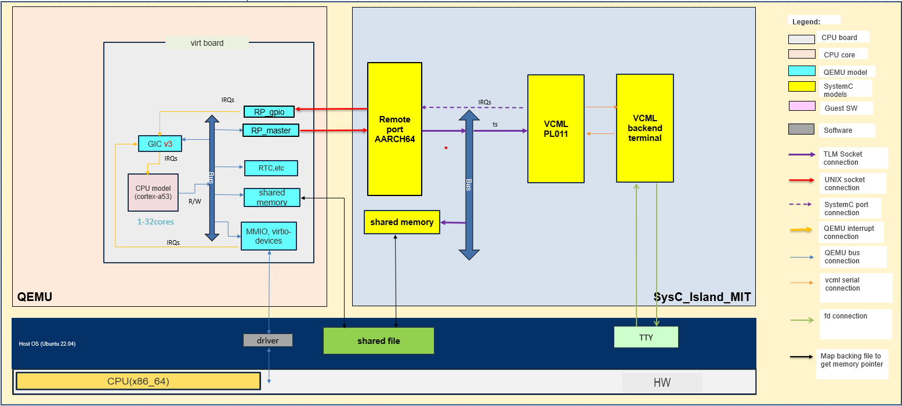
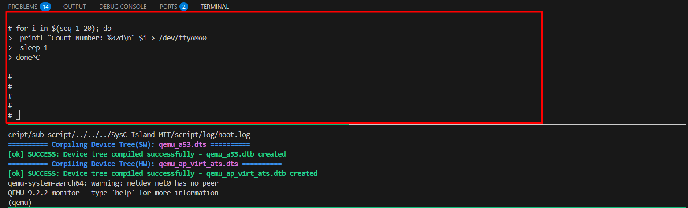

# SYSC_ISLAND_MIT README
## **Overview**


`SysC_Island_MIT` is a **sample SystemC-based simulation project** that demonstrates how to integrate existing SystemC components, including **[VCML PL011](https://github.com/machineware-gmbh/vcml/blob/main/doc/models/arm_pl011.md)**, **[VCML Backends](https://github.com/machineware-gmbh/vcml/blob/main/doc/backends.md)**, and **shared memory**.  

It interfaces with **[QEMU](https://www.qemu.org/)** via the Remote-Port, enabling the guest system to communicate with the SystemC models running as a separate process.


**[QEMU](https://github.com/qemu/qemu)**  is a generic open-source machine emulator and virtualizer. In this project, it runs the guest system that interacts with the SystemC simulation through the Remote-Port protocol. Using QEMU allows the guest system to run independently while providing a standard interface to the SystemC models.

**[VCML](https://github.com/machineware-gmbh/vcml/blob/main/doc/main.md)** is an open-source SystemC TLM-2.0-based framework from MachineWare. 

In this platform, the VCML PL011 UART and VCML backend enable interaction between the host console and the guest system running in QEMU.

- User input from the host console is delivered to the VCML PL011 model
  and propagated as interrupts to the QEMU CPU.
- Output data is generated by the guest system via MMIO writes and
  transmitted back to the host console.

---

### Shared Memory Mechanism

To improve data transfer performance between QEMU and the SystemC platform,
a shared memory mechanism is used instead of relying solely on socket-based
communication via Remote-Port.

- **QEMU side:**
  Shared memory is created using the
  **[QEMU memory-backend](https://www.qemu.org/docs/master/system/devices/ivshmem.html)**,
  which exposes a memory region that can be shared with external processes.

- **SystemC side:**
  The **[shared generic memory](https://github.com/machineware-gmbh/vcml/blob/main/doc/models/generic_mem.md)**
  model creates a generic memory and maps this memory region into the SystemC platform, allowing both
  QEMU and the SystemC platform to directly access the same physical memory through a shared file.


[](images/overview_sysc_island_mit.png)


---

## The following sections describe system requirements, installation, and environment setup for SysC_Island_MIT
## 1. System Requirements
|Category|Requirement for SysC_Island_MIT |Description|
|:---|:---|:---|
|Operating System | Ubuntu 22.04 LTS | OS version |
|CPU | Intel x86-64 <br> (Requires CPU support for AVX2 (Advanced Vector Extensions 2) instruction set) |  - |
| CMake | CMake 3.28 |  Installation instructions at [CMake GitHub](https://github.com/Kitware/CMake) |
| Compiler | GCC 11.4.0 |  Native GNU compiler |
| Physical RAM | Minimum 16 GB | - |
| Swap Space | Minimum 20 GB | - |
| Python | Python 3.10 | - |
|QEMU|QEMU v11.1.0|Guest system emulator. See [QEMU GitHub](https://github.com/qemu/qemu) for details.|

## 2. Installation
- Linux tool requirements:

|Category|Requirement Version|
|:---|:---|
|Pip|22.0.2|
|Meson|0.61.2|
|virglrenderer|1.1.1|
|ninja|1.10.1|

### For SysC_Island_MIT
* If your machine does not have the required libraries listed above, you need to install the libraries as follows:
```bash
# Installation libraries for SysC_Island_MIT
$> sudo apt-get update
$> sudo apt-get install -y libpython3-dev tmux
# Install device tree compiler (dtc)
$> sudo apt-get install -y device-tree-compiler
# Install libraries for QEMU
$> sudo apt-get install -y git python3-pip cmake \
wget libepoxy-dev pkg-config libvulkan-dev libpixman-1-dev \
libsdl2-dev libfdt-dev libnuma1 libslirp-dev \
libgtk-3-dev libv4l-dev libdw1 libelf-dev net-tools meson ninja-build
# Install Python dependencies
$> pip3 install --upgrade pip
$> pip3 install PyYAML tomli
# Install virglrenderer
$> git clone https://gitlab.freedesktop.org/virgl/virglrenderer.git --branch
virglrenderer-1.1.1 /tmp/virglrenderer && \
cd /tmp/virglrenderer && \
meson setup builddir -Dvenus=true -Drender-server=true -Dplatforms=auto && \
ninja -C builddir && \
sudo ninja -C builddir install && \
cd ~ && rm -rf /tmp/virglrenderer
```


## 3. Prepare SysC_Island_MIT environment
* Clone git repository 
```bash
$> git clone https://github.com/renesas/SysC_Island_MIT.git
```

* Clone the QEMU repository
```bash
$> cd <repo-directory>
$> git clone https://github.com/qemu/qemu.git
$> cd qemu
$> git checkout v11.1.0
```
> **Note:**
> QEMU must be cloned inside the root directory of this project
> (i.e. `<repo-directory>/qemu`) as required by the build and run scripts.
#  Setup SysC_Island_MIT environment
## 1️⃣ Setup Environment
```bash
cd SysC_Island_MIT/script

./build_env.sh # Builds QEMU v11.1.0 and the SysC_Island_MIT environment
```

### 🔧 Optional: Rebuild Utilities (utils) :
> ⚠️ **IMPORTANT:**  
> If you want to rebuild the utility tools, you **MUST run this step *before* executing**  
> **`./build_env.sh`**.  
> Otherwise, the environment may use outdated utility binaries.
#### Build utils

```bash
$> cd SysC_Island_MIT/utils

$> cmake -H. -G "Unix Makefiles" -B build -DCMAKE_CXX_STANDARD=17 

$> cmake --build build --target all --parallel 8
```
#### Integrate

```bash
$> cd SysC_Island_MIT/utils

$> cmake --install build --prefix prebuilt_x86_64

$> rm -rf prebuilt_x86_64/share
```


## 2️⃣ Start the co-simulation
```bash
./execute.sh 
```
> **Note:**
> Ensure that a valid Linux kernel image and root filesystem are available
> under `sw/Linux/`.
>
> By default, the following filenames are used:
> - `sw/Linux/Image` (kernel image)
> - `sw/Linux/rootfs.ext4` (root filesystem)
>
> These filenames are not fixed. Users can provide their own kernel and
> root filesystem with arbitrary names by updating the configuration in:
>
> `script/sub_script/config.sh`
>
> Specifically, modify the following variables:
>
> ```bash
> export SW_LINUX_IMAGE_PATH="<path-to-kernel-image>"
> export SW_LINUX_ROOTFS_PATH="<path-to-rootfs>"
> ```
>
> Users can also modify the software device tree (DTS) by editing
> `arm64-virt-guest.dts`.
## 3️⃣ Run the shell to verify VCML PL011 and VCML backend functionality 
**Run this command in VP console**  
```bash
for i in $(seq 1 20); do
 printf "Count Number: %02d\n" $i > /dev/ttyAMA0
 sleep 1
done
```
[](images/console.png)

## Example Output

```bash
login:root
#
for i in $(seq 10); do
>  printf "Count Number: %02d\n" $i > /dev/ttyAMA0
>  sleep 1
> done
Count Number: 01
Count Number: 02
Count Number: 03
Count Number: 04
Count Number: 05
Count Number: 06
Count Number: 07
Count Number: 08
Count Number: 09
Count Number: 10
```

  This test validates the end-to-end TX, RX, and interrupt handling paths of the
  VCML PL011 UART model, as integrated with the VCML backend and QEMU via the
  Remote-Port interface.

  The loop continuously writes data from the guest Linux system to
  `/dev/ttyAMA0`, exercising the transmit (TX) path from the guest CPU,
  through Remote-Port, to the VCML PL011 model and finally
  to the host terminal via the VCML backend.

  At the same time, any user input from the host terminal triggers the
  receive (RX) path. The input is forwarded to the VCML PL011 model,
  which generates an interrupt to notify the guest CPU. The Linux driver
  then handles the interrupt and reads the received data via MMIO.

  Overall, this example validates:
  - Data transmission from guest to host (TX path)
  - Data reception from host to guest (RX path)
  - Interrupt propagation from VCML PL011 to the QEMU CPU

  The continuous loop helps verify stability and correctness of the
  VCML PL011 integration under repeated data transactions.


## **Included Open Source Software (OSS)**
This project includes the following OSS components:

- **Google C++ Testing Framework 20180719-snapshot-6ce9b98f**  
  This component is distributed with its own LICENSE file.  
  See `third-party/Google_C++_Testing_Framework_20180719-snapshot-6ce9b98f` for details.

- **vcml v2025.04.29**  
  This component is distributed with its own LICENSE file.  
  See `third-party/vcml_v2025.04.29` for details.

- **rapidjson 1.1.0**  
  This component is distributed with its own LICENSE file.  
  See `third-party/rapidjson_1.1.0` for details.

- **SystemC 2.3.4**  
  This component is distributed with its own LICENSE file.  
  See `third-party/systemc_2.3.4` for details.

- **mwr v2025.05.29**  
  This component is distributed with its own LICENSE file.  
  See `third-party/mwr_v2025.05.29` for details.

- **lua v5.4.4**  
  This component is distributed with its own LICENSE file.  
  See `third-party/lua_v5.4.4` for details.

- **SystemC CCI v1.0.1**  
  This component is distributed with its own LICENSE file.  
  See `third-party/SystemC_CCI_v1.0.1` for details.

- **vcml-cci v2024.05.27**  
  This component is distributed with its own LICENSE file.  
  See `third-party/vcml-cci_v2024.05.27` for details.

- **libsystemctlm-soc v2.0**  
  This component is distributed with its own LICENSE file.  
  See `third-party/libsystemctlm-soc_v2.0` for details.

- **libgsutils v2.2.1**  
  This component is distributed with its own LICENSE file.  
  See `third-party/libgsutils_v2.2.1` for details.

- **base-components**  
  This component is distributed with its own LICENSE file.  
  See `third-party/base-components` for details.

- **QEMU v11.1.0**
  QEMU is distributed under the **GNU General Public License v2 (GPLv2)**, with some components under compatible open-source licenses.  
  See [QEMU COPYING](https://github.com/qemu/qemu/blob/master/COPYING) for details.

## **Project License**
`SysC_Island_MIT` is licensed under the **BSD-3-Clause License**.  
See the `LICENSE` file in the root directory for full details.